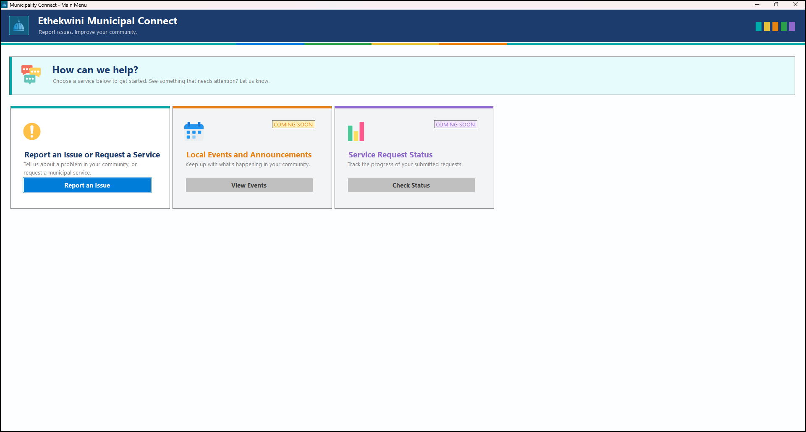
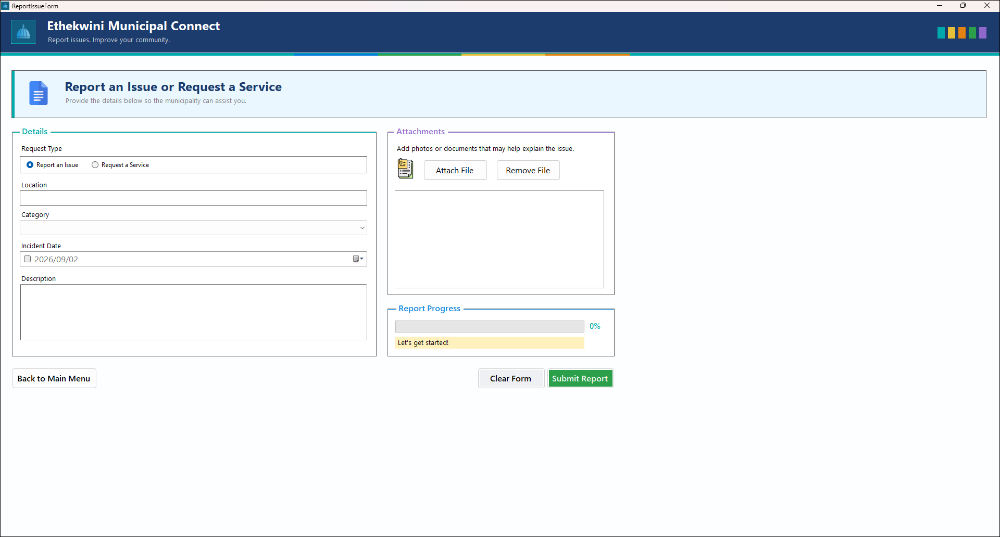

# 🏛️ MunicipalityConnect

A Windows Forms application designed to provide residents with a simple and user-friendly way to report municipal issues and request services.

---

## 📌 Project Overview

**MunicipalityConnect** is a C# Windows Forms application developed to improve communication between residents and their municipality.

The application allows users to submit municipal issues or service requests by providing relevant information such as the location, category, incident date, description, and supporting attachments.

The project focuses on providing a clean and accessible interface while demonstrating the use of **object-oriented programming, data structures, file handling, validation, and event-driven programming**.

---

## ✨ Features

### 📝 Report an Issue / Request a Service

Users can provide:

- Request type
  - Report an Issue
  - Request a Service
- Location
- Issue category
- Incident date
- Description
- Supporting attachments

### 📎 File Attachments

Users can attach supporting files to their report.

Attached files are:

- Displayed in the application before submission
- Removable before submission
- Copied into the application's `Attachments` directory when the report is submitted
- Stored inside a folder associated with the generated query code

Example:

```text
Attachments/
└── MC-2026-0001/
    ├── image.jpg
    └── document.pdf
```

## 📸 Screenshots

<p align="center">
  
  
</p>

## To load and run the MunicipalityConnect application, follow the steps below:

1. Download or clone the project from the GitHub repository.
2. Open Visual Studio on a Windows computer.
3. Select Open a project or solution from the Visual Studio start screen.
4. Navigate to the downloaded project folder and open the MunicipalityConnect.sln solution file.
5. Allow Visual Studio to load the solution and its associated project files.
6. Once the project has loaded, ensure that MunicipalityConnect is selected as the startup project.
7. Build the solution by selecting:
   
    **Build → Build Solution**

    Alternatively, press:

   **Ctrl + Shift + B**
  
  8. If the solution builds successfully, run the application by selecting:
  
      **Debug → Start Without Debugging**
      
      or press:
      
      **Ctrl + F5**

9. The MunicipalityConnect Main Menu will open and the application can then be tested.

## System Requirements
Windows operating system
Microsoft Visual Studio
.NET development tools required for Windows Forms
Access to the project files and solution (.sln) file

### Project Developer
St10355256 Halalisile Mzobe

